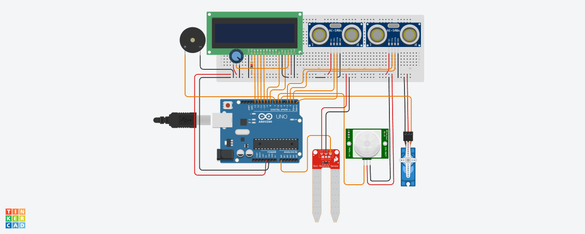

# Garbage Monitoring and Controlling with Smart Segregation of Dry and Wet Waste

## Project Description
The project aims to develop a system for garbage monitoring and controlling with smart segregation of dry and wet waste using sensors and Arduino. This system helps to automate the process of waste segregation, thereby reducing human intervention and promoting efficient waste management.

## Table of Contents
- [Project Description](#project-description)
- [Features](#features)
- [Hardware Requirements](#hardware-requirements)
- [Software Requirements](#software-requirements)
- [Wiring Diagram](#wiring-diagram)
- [Installation](#installation)
- [Usage](#usage)
- [Applications](#applications)
- [Advantages](#advantages)
- [Limitations](#limitations)
- [Future Scope](#future-scope)
- [Contributing](#contributing)
- [Contact](#contact)

## Features
- Automatic detection and segregation of dry and wet waste.
- Real-time monitoring of waste levels in bins.
- Notifications through buzzer and LCD display when bins are full.
- Reduction in manual labor and health risks for waste workers.

## Hardware Requirements
- Arduino UNO
- IR Proximity Sensor
- Moisture Sensor
- Ultrasonic Sensor
- Servo Motor
- 16x2 LCD Display
- Buzzer
- 10K Potentiometer
- 4 x AA Battery Holder Case

## Software Requirements
- Arduino IDE
- Libraries: `Servo.h`, `LiquidCrystal.h`, `Ultrasonic.h`

## Wiring Diagram

## Installation
1. **Setup Hardware:**
   - Connect the IR Proximity Sensor, Moisture Sensor, Ultrasonic Sensor, Servo Motor, LCD Display, Buzzer, and Potentiometer to the Arduino UNO as per the wiring diagram.

2. **Arduino IDE:**
   - Install the Arduino IDE from [Arduino official website](https://www.arduino.cc/en/Main/Software).
   - Install the required libraries (`Servo.h`, `LiquidCrystal.h`, `Ultrasonic.h`).

3. **Upload Code:**
   - Write or paste the provided Embedded C code into the Arduino IDE.
   - Connect your Arduino UNO to your computer and upload the code.

## Usage
1. Power on the system using the 4 x AA Battery Holder Case.
2. The IR Proximity Sensor detects the presence of waste.
3. The Moisture Sensor determines if the waste is dry or wet.
4. The Servo Motor directs the waste to the respective bin based on the sensor's reading.
5. The Ultrasonic Sensor monitors the bin levels.
6. The LCD Display shows the bin status, and the Buzzer alerts when the bin is full.

## Applications
- **Residential:** Helps residents sort their waste into different categories.
- **Commercial:** Useful in restaurants, hotels, and offices for waste sorting.
- **Industrial:** Helps factories and warehouses manage their waste.
- **Municipal:** Assists municipalities in waste collection and disposal management.

## Advantages
- Reduces the amount of waste sent to landfills.
- Promotes recycling and proper waste disposal.
- Minimizes health risks for waste workers.
- Improves overall efficiency of waste management processes.

## Limitations
- Initial setup and hardware costs.
- Requires maintenance and regular monitoring.
- Dependent on sensor accuracy and reliability.

## Future Scope
- Integration with IoT for remote monitoring and control.
- Development of more advanced algorithms for waste segregation.
- Expansion to include more types of waste materials.

## Contributing
Contributions are welcome! Please follow the standard contributing guidelines for pull requests and issues.

## Contact
For any questions or support, please contact:

- **S Suhas**
- **Shreyas P**
- **Vyshnavi H K**
- **Chitra A**
